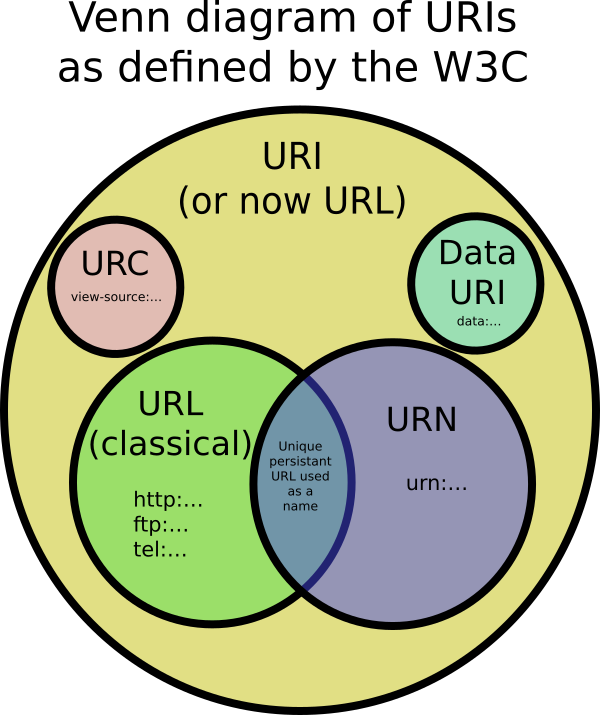

## Notes :memo:

| Name | About | Example | 
| -- | :-: | -- |
| URI | Uniform Resource Identifier | https://twitter.com/dev_oswld/status/1258838176594038787 |
| URL | Uniform Resource Locator | https://github.com/ |
| URN | Uniform Resource Name | urn:isbn:9788499924885 |
| URC | Uniform Resource Citation | view-source:https://github.com/ | 

HTTP Methods overview 
| HTTP Verb | CRUD |
| --- | --- |
| POST | Create |
| GET | Read | 
| PUT | Update/Replace |
| PATCH | Update/Modify | 
| DELETE | Delete | 

---

HTTP Status codes
| Code | About | Description | 
| --- | --- | --- |
| 1xx | Informational response | The request was received, continuing process | 
| 2xx | Successful | The request was successfully received, understood, and accepted |
| 3xx | Redirection  | Further action needs to be taken in order to complete the request |
| 4xx | Client error | The request contains bad syntax or cannot be fulfilled |
| 5xx | Server error | The server failed to fulfil an apparently valid request |

[Go to start](.././README.md)