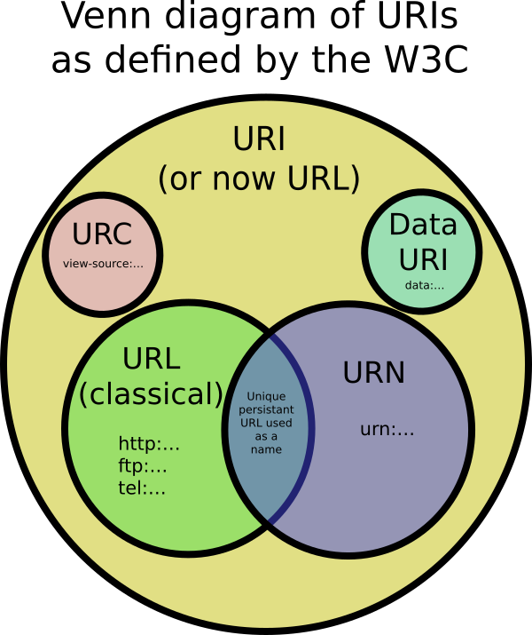

## Notes :memo:

| Name | About | Example | 
| -- | :-: | -- |
| URI | Uniform Resource Identifier | https://twitter.com/dev_oswld/status/1258838176594038787 |
| URL | Uniform Resource Locator | https://github.com/ |
| URN | Uniform Resource Name | urn:isbn:9788499924885 |
| URC | Uniform Resource Citation | view-source:https://github.com/ | 

---

**HTTP Methods overview** 
| HTTP Verb | CRUD |
| --- | --- |
| POST | Create |
| GET | Read | 
| PUT | Update/Replace |
| PATCH | Update/Modify | 
| DELETE | Delete | 

---

**HTTP Status codes**
| Code | About | Description | 
| --- | --- | --- |
| 1xx | Informational response | The request was received, continuing process | 
| 2xx | Successful | The request was successfully received, understood, and accepted |
| 3xx | Redirection  | Further action needs to be taken in order to complete the request |
| 4xx | Client error | The request contains bad syntax or cannot be fulfilled |
| 5xx | Server error | The server failed to fulfil an apparently valid request |

---

**Cookies**

Is a small piece of data, they are different types for example: session cookies, permanent cookies, secure cookies, http-only cookies, third-party cookies and so on. A cookie consists of the following two or more components name and value. 

---

**Another resources**
- [Flask tutorials on Google App Engine](https://code.luasoftware.com/tags/flask/)
- [Full Stack Web Development with Flask.](https://github.com/realpython/discover-flask)
- [Flask tutorial in Spanish blog](https://j2logo.com/tutorial-flask-espanol/)
- [DevWithMe channel](https://www.youtube.com/playlist?list=PLBQzvdjNG8c_Cu3OOlynXPAk-Au5z5x9q)

----

**The future**
- [Tricks for Python](https://realpython.com/)
- [Django project, write your first app](https://www.djangoproject.com/start/)
- [Django Web Framework](https://developer.mozilla.org/en-US/docs/Learn/Server-side/Django)

[Go to start](.././README.md)
